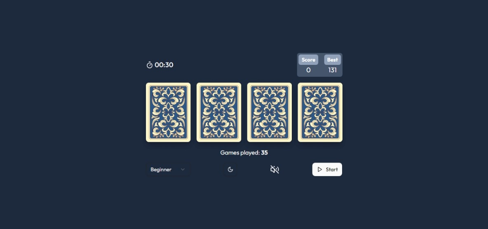
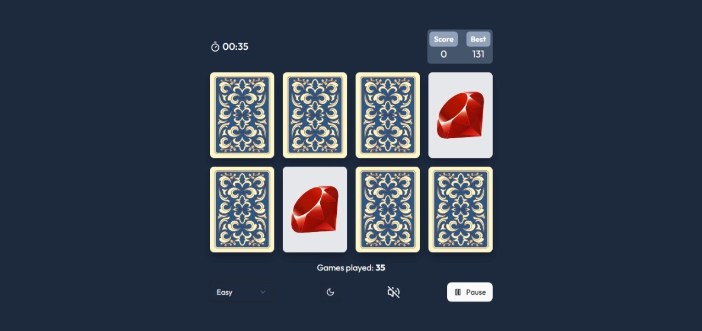

# Mind Maze

Welcome to MindMaze, an engaging memory game designed to challenge and enhance your cognitive skills. MindMaze offers a delightful mix of fun and brain exercise, making it a perfect way to keep your mind sharp.

## Table of Contents

- [Project Overview](#project-overview)
- [Features](#features)
- [Screenshots](#screenshot)
- [Tech Stack](#tech-stack)
- [Getting Started](#getting-started)
  - [Prerequisites](#prerequisites)
  - [Installation](#installation)
  - [Usage](#usage)
- [Contributing](#contributing)
- [License](#license)
- [Contact](#contact)

## Project Overview

MindMaze is a memory game built with modern web technologies aimed at providing a seamless and enjoyable gaming experience. Players must match pairs of cards within a time limit, sharpening their memory and concentration as they progress through increasingly difficult levels.

## Features

- **Intuitive Gameplay**: Easy to understand, yet challenging enough to keep players engaged.

- **Multiple Levels**: Increasing levels of difficulty to continuously test and improve your memory.

- **Stunning Graphics**: Visually appealing card designs and smooth animations.

- **Responsive Design**: Enjoy MindMaze on any device, be it desktop, tablet, or mobile.

- **Sound Effects**: Enjoy immersive sound effects that enhance the gaming experience.

- **Dark Mode**: Play comfortably at any time of the day with the dark mode feature.

## Screenshot




## Tech Stack

- **Frontend**: React
- **Language**: TypeScript
- **State Management**: Zustand
- **Styling**: Tailwindcss
- **Animations**: Framer Motion
- **Testing**: Jest, React Testing Library
- **Build Tool**: Esbuild

## Getting Started

To get a local copy of the project up and running, follow these steps.

### Prerequisites

Ensure you have the following installed:

- Node.js (version 12 or later)
- npm (version 6 or later) or bun

### Installation

1. Clone the repo
   ```sh
   git clone https://github.com/peterxavier01/mind-maze.git
   ```
2. Navigate to the project directory
   ```sh
   cd mind-maze
   ```
3. Install dependencies

   ```sh
   npm install
   ```

   or

   ```sh
   bun install
   ```

### Usage

1. Start the development server

   ```sh
   npm run dev
   ```

   or

   ```sh
   bun run dev
   ```

2. Open your browser and go to http://localhost:5173 to view the website.

## Contributing

Contributions are what make the open source community such an amazing place to be learn, inspire, and create. Any contributions you make are greatly appreciated.

1. Fork the Project
2. Create your Feature Branch (git checkout -b feature/AmazingFeature)
3. Commit your Changes (git commit -m 'Add some AmazingFeature')
4. Push to the Branch (git push origin feature/AmazingFeature)
   Open a Pull Request

## License

Distributed under the MIT License.

## Contact

Peter Uadiale - uadialepeter@gmail.com

Project Link: https://github.com/peterxavier01/mind-maze
